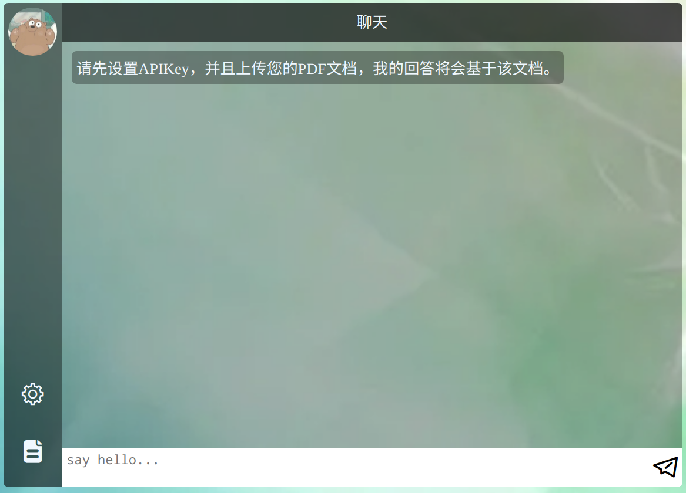

## customized chat

### 简介

基于ChatGpt，Java，SpringBoot，Vue，Milvus向量数据库的定制化聊天Web demo

- 可开发成个人知识库
- 针对某品牌的智能客服
- 私人助理
- more
### 在线体验

TODO



### 前端项目地址
https://github.com/bigcyy/customized-chatgpt-vue

### 原理

上传PDF，让ChtGpt基于PDF的内容回答问题，原理很简单：将内容分割然后embedding存入向量数据库，当用户询问时将问题embedding，拿embedding结果去向量数据库查询相似度最高的几段话丢给ChatGpt让他组织语言并结合自己丰富的知识进行润色。

### 本地使用

> 注意，你需要有OpenAI账号并且创建一个apiKey，由于国内无法使用连接OpenAi服务所以你需要配置代理

1. 安装Milvus向量数据库

   ```
   wget https://github.com/milvus-io/milvus/releases/download/v2.2.2/milvus-standalone-docker-compose.yml -O docker-compose.yml
   sudo docker-compose up -d
   ```

2. 克隆后端项目

   ```
   git clone git@github.com:bigcyy/customized-chatgpt.git
   ```

3. 用idea打开项目

4. 初始化Milvus向量数据库表结构以及配置代理

   * application.yml中配置向量数据库连接地址和端口(本地不需要修改)，然后配置你的代理ip和端口

   * 找到项目test文件夹下的CustomizedChatApplicationTests.java，运行prepare函数创建表结构

5. 找到项目主函数运行后端

6. 克隆并运行前端项目

```
git clone git@github.com:bigcyy/customized-chatgpt-vue.git
cd customized-chatgpt-vue
npm install
npm run serve
```

7. 访问控制台输出的地址

8. 界面左下角配置你的apiKey

9. 界面左下角上传你需要定制聊天的PDF文件
10. enjoy it

### todo

- 支持更多的文件格式
- token计数
- 优化文本的分割
- 抽离embedding模型，使其能更优雅的切换为自己训练的模型或者其他公开的模型

### 参考资料

https://twitter.com/chuangbo/status/1631461656151887873 作者详细的描述了该方案的运行流程，本项目也是参考自该文章

### 相关项目

- https://github.com/GanymedeNil/document.ai
- https://github.com/mckaywrigley/paul-graham-gpt